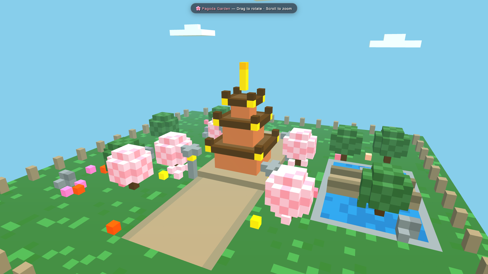

# DeepSeek V4 Flash Vision-Exp on a Mac Studio (128 GB) with DwarfStar (ds4)

Reproducible recipe + measured evidence for running **DeepSeek V4 Flash Vision-Exp** locally on a
**Mac Studio M4 Max, 128 GB** using [antirez/ds4 (DwarfStar)](https://github.com/antirez/ds4) —
a native C + Metal engine, no Python, OpenAI-compatible server. Includes the voxel-pagoda visual
run and the honest single-Spark comparison.

Verified **2026-09-02** on ds4 commit `110afdd`, macOS 26.5.2.

## TL;DR

| | |
|---|---|
| Model | `DeepSeek-V4-Flash-Vision-Exp-IQ2XXS-w2Q2K-AProjQ8-SExpQ8-OutQ8.gguf` (80.8 GiB, antirez imatrix q2) |
| Speculative | DSpark (Vision-Exp support GGUF, 5.6 GiB), confidence 0.6 |
| Vision | `DeepSeek-V4-Flash-Vision-Encoder.gguf` (0.9 GiB) |
| Memory | 81.6 GiB planned resident (80.76 model + 0.61 KV + 0.25 buffers) at ctx 32768 |
| Load time | ~2 min from cold page cache |
| **Decode, thinking off** | **31.7 tok/s** code (1,656 tok) · **28.5 tok/s** prose (404 tok) |
| **Decode, thinking on (pagoda, uncapped)** | **29.8 tok/s** over 26,415 completion tokens, 886 s wall, natural stop |
| TTFT | 0.4–1.4 s on short prompts |

Reference points on the same engine ([antirez speed-bench](https://github.com/antirez/ds4/tree/main/speed-bench)):
M4 Max q2 *without* DSpark = 26.8 tok/s @2K ctx → 24.5 @32K; single DGX Spark GB10 = 18.1 → 13.8.
DSpark is worth ~+10–20% here, more on code than prose.

## Recipe

### 0. Hardware / prerequisites
- Apple Silicon Mac with **≥ 96 GB** unified memory (128 GB tested). Q2 is close to the ceiling — nothing else large can be resident.
- Xcode command-line tools, `make`, `hf` CLI (`brew install huggingface-cli`), ~90 GB free disk.

### 1. Build ds4 (Metal)
```bash
git clone https://github.com/antirez/ds4.git ~/ds4 && cd ~/ds4
make -j"$(sysctl -n hw.ncpu)"     # builds ds4, ds4-server, ds4-bench, ds4-eval, ds4-agent (~8 s on M4 Max)
```
If you have an old checkout: `git pull --ff-only && make clean && make -j`. Vision-Exp + GLM support are recent (Aug/Sep 2026).

### 2. Download the GGUFs
Either the upstream helper (`./download_model.sh ds4f-vision-q2 && ./download_model.sh ds4f-vision-dspark`) or, if you prefer plain `hf download` into `gguf/`, [`scripts/fetch_models.sh`](scripts/fetch_models.sh) pulls the exact same files (it also grabs GLM-5.3-Flash-Q2 — delete that line if you only want DeepSeek). Byte sizes we verified against HF:

| File | Bytes |
|---|---:|
| `DeepSeek-V4-Flash-Vision-Exp-IQ2XXS-w2Q2K-AProjQ8-SExpQ8-OutQ8.gguf` | 86,720,111,776 |
| `DeepSeek-V4-Flash-Vision-Exp-DSpark-support.gguf` | 5,989,114,528 |
| `DeepSeek-V4-Flash-Vision-Encoder.gguf` | 932,857,760 |

Do **not** pair the 0731 DSpark file with the Vision-Exp model — they are checkpoint-specific.

### 3. Free RAM, then serve
```bash
bash scripts/serve_vision_exp.sh
```
which is essentially:
```bash
./ds4-server \
  -m gguf/DeepSeek-V4-Flash-Vision-Exp-IQ2XXS-w2Q2K-AProjQ8-SExpQ8-OutQ8.gguf \
  --vision gguf/DeepSeek-V4-Flash-Vision-Encoder.gguf \
  --dspark --mtp-model gguf/DeepSeek-V4-Flash-Vision-Exp-DSpark-support.gguf \
  --ctx 32768 --host 0.0.0.0 --port 8000
```
On our machine an idle oMLX server was holding 19.8 GB; stopping it took headroom from 82 → 106 GB. Check with
`vm_stat` before loading. Watch the log for `listening on http://0.0.0.0:8000` and
`DSpark target-hidden capture enabled: layers=40,41,42`.

### 4. Verify
```bash
curl -s http://127.0.0.1:8000/v1/models | python3 -m json.tool | head -20   # id: deepseek-v4-flash
python3 scripts/measure_tok_s.py                 # thinking off, code prompt → decode tok/s from streamed usage
python3 scripts/measure_tok_s.py --think "..."   # thinking on
```

### Server behaviour worth knowing
- Model id is `deepseek-v4-flash` (a `deepseek-v4-pro` alias is also listed; same model).
- Thinking defaults **on** (high effort). Disable per request with `"thinking": {"type": "disabled"}`.
  `reasoning_effort=max` needs `--ctx ≥ 393216`; smaller contexts silently use high.
- In thinking mode the server **ignores client sampling knobs** (temperature/top_p) — like the official API.
- DSpark commits verifier state directly; output can differ from one-token decode. Use `--dspark-strict` for byte-exact reproducibility.

## Visual run: voxel pagoda (thinking on, uncapped)

Same frozen prompt used for our Spark duels (`evidence/pagoda/prompt.txt`, SHA-256 `ff77a19d…5247b`):
one user message, no system prompt, no `max_tokens`, no wall timeout, streamed with usage.

| Metric | Value |
|---|---:|
| Completion tokens | 26,415 (reasoning ≈ 56.7K chars, answer 20.1K chars) |
| Wall | 886.5 s |
| TTFT | 1.41 s |
| Decode | **29.84 tok/s** |
| Finish | `stop` (natural) |
| HTML | 18,987 bytes, Three.js r128 + OrbitControls via CDN |



Video: [`assets/pagoda-mac-ds4-vision-exp-q2.mp4`](assets/pagoda-mac-ds4-vision-exp-q2.mp4) — 1920×1080, 24 fps, 8 s, 192 unique frames, zero page errors.

### Honest notes on the artifact
1. **The original HTML renders black.** The model set `vertexColors: true` on a `MeshLambertMaterial` for an
   `InstancedMesh` that only has `instanceColor` (no per-vertex color attribute), so every voxel shaded black.
   `evidence/pagoda/index.html` is the untouched original; `index.capture-repaired.html` differs by exactly one
   line (drop `vertexColors: true`). Screenshot of the unrepaired original: `assets/pagoda-original-unrepaired-black.png`.
   Pretty scene, real bug — that's a model-quality result, not a capture problem.
2. **The scene is static by design.** The model wired OrbitControls (drag to rotate) with no auto-rotate or
   petal animation. For the video we set `controls.autoRotate = true` at capture time using the artifact's own
   controls; nothing else was changed. Receipt: `evidence/pagoda/capture-receipt.json`.

## How this compares (same prompt, same contract)

| Deployment | Quant | Decode | Notes |
|---|---|---:|---|
| **Mac Studio M4 Max 128 GB, ds4 + DSpark (this repo)** | IQ2_XXS/Q2_K experts | **29.8 tok/s** | natural stop, 26.4K tokens |
| 2× DGX Spark, vLLM TP2 + DSpark K6, official FP8 | FP8 E4M3, NVFP4 KV | 54.95 tok/s | ISS prompt, 15.7K tokens, [recipe](https://github.com/Weschera/DeepSeek-v4-Flash-DSpark-1M-NVFP4-KV-2x-DGX-Spark) |
| 1× DGX Spark, ds4 CUDA (antirez bench, q2) | IQ2_XXS/Q2_K | 18.1 → 13.8 tok/s | no DSpark, 2K→64K ctx |

So: a 128 GB Mac runs the *same Vision-Exp checkpoint* at roughly **55% of a two-Spark FP8 pair** and about
**1.7–2× a single Spark on the same engine** — with 2-bit routed experts. Quality cost of Q2 vs FP8 on visual
tasks is the open question; the pagoda above is one data point (coherent, colorful scene; one material bug).

## Files
- `scripts/fetch_models.sh` — plain `hf download` of the exact GGUFs
- `scripts/serve_vision_exp.sh` — RAM cleanup + server launch
- `scripts/measure_tok_s.py` — streamed tok/s from real usage, thinking on/off
- `evidence/pagoda/` — prompt, request, summary.json (native usage/timing), original + repaired HTML, capture receipt
- `evidence/ds4-server-startup.log` — memory plan / DSpark detection lines

## Credits
- **[antirez](https://github.com/antirez)** — DwarfStar engine and the imatrix q2 GGUFs ([antirez/deepseek-v4-gguf](https://huggingface.co/antirez/deepseek-v4-gguf)). This repo is just a verified deployment log on top of his work.
- DeepSeek — V4 Flash Vision-Exp and the DSpark draft model.
- llama.cpp / GGML — which ds4 openly builds on.

MIT for the scripts here; model weights under their own licenses.
